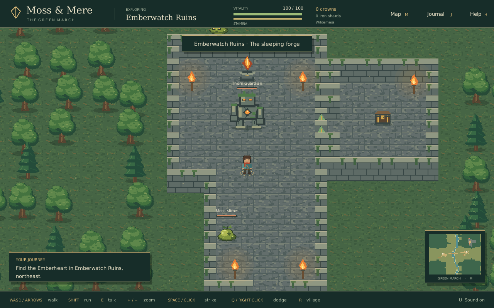

# Moss & Mere — web release

This branch contains only the deployable web build. Source code lives on `master`.

- [Play the game](https://agerasev.github.io/moss-and-mere/)
- [Example screenshot](https://agerasev.github.io/moss-and-mere/preview.png)
- Source commit: `dda4e664c043e97be463b4f7b610deb27d52be2c`



Configure GitHub Pages to deploy from `gh-pages`, folder `/(root)`.

Build from the source checkout using the published wgame libraries:

```sh
./scripts/build-web.sh /moss-and-mere/
```

Copy the generated files to this branch's root. Include `.nojekyll`, `LICENSE`,
`FONT-LICENSE.txt`, and the stable `preview.png` image. Generated assets do not
belong on the source branch. The font license covers the fonts embedded in WASM.
